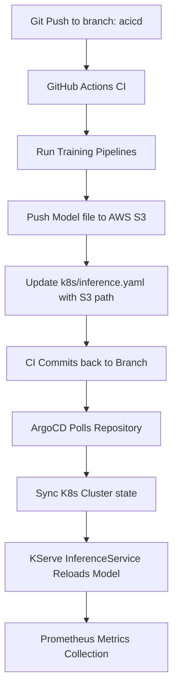

# 🩸 End-to-End Diabetes Prediction MLOps Platform

[](https://github.com/bittush8789/liberty-claims-router-mlops/actions/workflows/mlops-pipeline.yaml)
[](https://fastapi.tiangolo.com/)
[](https://kserve.github.io/website/)
[](https://argoproj.github.io/argo-cd/)

A production-grade, end-to-end MLOps platform for diagnosing diabetes risk using the Pima Indians Diabetes dataset. The system integrates standard training pipelines, DVC tracking, AWS S3 storage, KServe serving, ArgoCD GitOps sync, and Prometheus telemetry.

---

## 🏗️ System Architecture & GitOps Flow



---

## 📁 Project Layout

```
end-to-end-diabetes-prediction-mlops/
├── .github/workflows/
│   └── mlops-pipeline.yaml  # GitHub Actions pipeline definitions
├── argocd/
│   └── application.yaml     # ArgoCD GitOps synchronizations
├── k8s/
│   ├── serviceaccount.yaml  # K8s Namespaces, Secrets and SAs
│   └── inference.yaml       # KServe InferenceService definition
├── src/
│   ├── components/          # Modular pipeline stages
│   │   ├── data_ingestion.py
│   │   ├── data_validation.py
│   │   ├── data_transformation.py
│   │   ├── model_trainer.py
│   │   └── model_evaluation.py
│   ├── pipeline/
│   │   ├── training_pipeline.py
│   │   └── prediction_pipeline.py
│   ├── logger.py
│   ├── exception.py
│   └── utils.py
├── frontend/
│   ├── index.html           # Diagnostic client UI form
│   ├── about.html           # Performance stats dashboards
│   ├── style.css
│   └── script.js
├── app.py                   # FastAPI prediction server
├── train.py                 # Training script runner
├── dvc.yaml                 # DVC pipeline commands
├── params.yaml              # Hyperparameters configurations
├── Dockerfile
├── requirements.txt
└── README.md
```

---

## 🛠️ Step-by-Step MLOps Setup Guide

Follow these steps to configure the end-to-end MLOps pipeline from scratch:

### Step 1: GitHub Repository Secrets Configuration
To enable the GitHub Actions CI/CD to communicate with AWS S3, add the following secrets under **Repository Settings -> Secrets and Variables -> Actions -> Repository Secrets**:
- `AWS_ACCESS_KEY_ID`
- `AWS_SECRET_ACCESS_KEY`

---

### Step 2: DVC Setup & Model Tracking
Initialize DVC to track intermediate datasets and models:
1. **Initialize DVC**:
   ```bash
   dvc init
   ```
2. **Add AWS S3 bucket as remote storage**:
   ```bash
   dvc remote add -d myremote s3://diabetes-model-bucket/models
   ```
3. **Track model artifact**:
   ```bash
   dvc add models/diabetes_model.pkl
   ```
4. **Push data tracker files**:
   ```bash
   dvc push
   ```

---

### Step 3: Run Model Pipeline Locally
Before deploying, trigger model ingestion, data validation schema reports, and train standard models (Logistic Regression, Random Forest, XGBoost):
```bash
# Run full training orchestration
python train.py
```
This writes:
- `artifacts/preprocessor.pkl`
- `models/diabetes_model.pkl`
- `validation_report.yaml` (schema report)
- `metrics.json` (performance scores)

---

### Step 4: Run Application Server Locally
Start the FastAPI server:
```bash
uvicorn app:app --port 8000
```
- Open **[http://localhost:8000](http://localhost:8000)** to view the Diagnostic UI.
- Health Check: `GET http://localhost:8000/health`
- Prometheus Exporter Telemetry: `GET http://localhost:8000/metrics`

---

### Step 5: Kubernetes & KServe Deployment
Deploy the model configurations to your Kubernetes cluster:
1. **Create KIND Cluster (Optional local environment)**:
   ```bash
   kind create cluster --name diabetes-cluster
   ```
2. **Install KServe Serving core**:
   ```bash
   kubectl apply -f https://github.com/kserve/kserve/releases/download/v0.11.0/kserve.yaml
   ```
3. **Apply service accounts, AWS credentials secrets, and namespace**:
   ```bash
   kubectl apply -f k8s/serviceaccount.yaml
   ```
4. **Deploy KServe predictor**:
   ```bash
   kubectl apply -f k8s/inference.yaml
   ```

---

### Step 6: ArgoCD GitOps Deployment
Automate manifests deployment on git pushes:
1. **Deploy ArgoCD core**:
   ```bash
   kubectl create namespace argocd
   kubectl apply -n argocd -f https://raw.githubusercontent.com/argoproj/argo-cd/stable/manifests/install.yaml
   ```
2. **Deploy GitOps application tracking**:
   ```bash
   kubectl apply -f argocd/application.yaml
   ```

ArgoCD will continuously poll the branch `acicd` and deploy changes whenever `k8s/inference.yaml` is updated by GitHub Actions.

---

## 📈 Monitoring Telemetry (Prometheus & Grafana)

The `/metrics` endpoint exports Prometheus metric primitives:
- `diabetes_predictions_total` (counter)
- `diabetes_diabetic_total` / `diabetes_non_diabetic_total` (counters)
- `diabetes_prediction_latency_seconds_average` (gauge)

Add target job configuration to your `prometheus.yml`:
```yaml
scrape_configs:
  - job_name: 'diabetes-predictor-service'
    static_configs:
      - targets: ['localhost:8000']
```
Import the metrics registry configurations to Grafana to visualize diagnostics charts.
