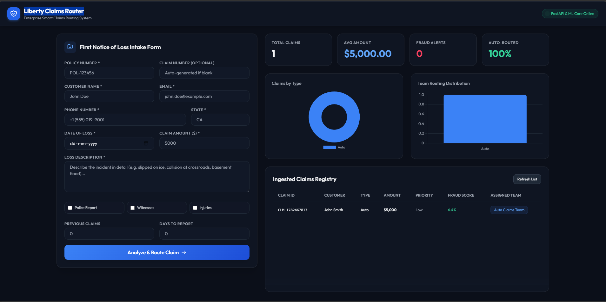
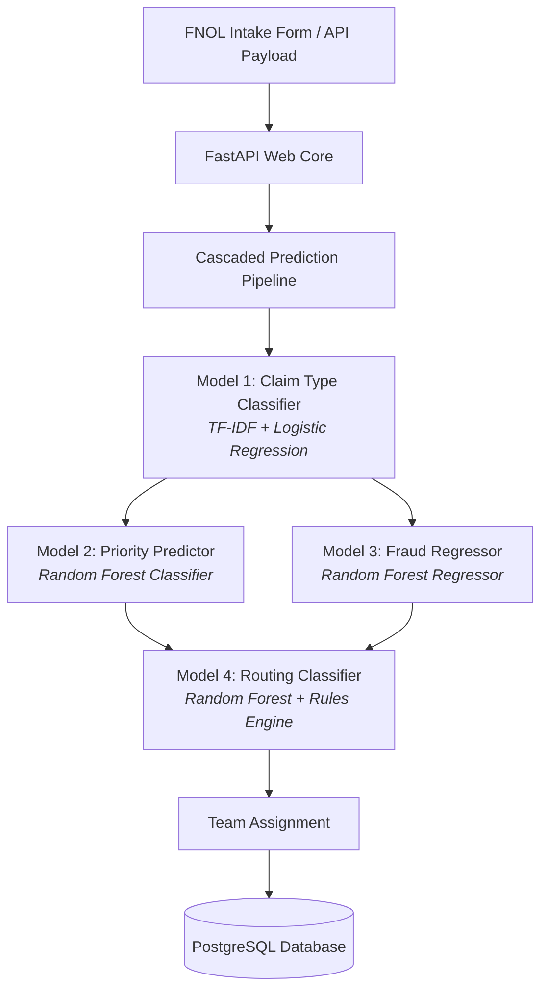

# 🗽 Liberty Claims Router

[](https://www.python.org/)
[](https://fastapi.tiangolo.com/)
[](https://scikit-learn.org/)
[](https://mlflow.org/)

An enterprise-grade, production-ready **First Notice of Loss (FNOL) Intelligent Routing System** that automates claims ingestion, classifies loss types, evaluates fraud probability, predicts priority levels, and routes claims to dedicated teams in real-time.



---

## 🏗️ System Architecture

The pipeline consists of four machine learning models connected in a cascaded execution flow:



---

## 🌟 Key Features

*   **Cascaded ML Models**: 
    *   **Model 1 (Claim Type)**: Maps loss descriptions to *Auto, Property, General Liability, or Workers Compensation*.
    *   **Model 2 (Priority)**: Predicts priority (*Low, Medium, High, Critical*) from claim amount and injuries.
    *   **Model 3 (Fraud Score)**: Evaluates fraud risk (0-100 score).
    *   **Model 4 (Routing)**: Recommends dispatcher team based on predictions and business overrides.
*   **Web Dashboard**: Premium interactive visual cockpit containing charts, KPIs, and claim records registry.
*   **Database Auditing**: Complete schemas for both claim metadata storage and prediction logs for compliance.
*   **CI/CD Pipeline**: GitHub Action for code linting, pipeline verification, and docker health checks.

---

## 📁 Project Directory Structure

```
insurance-fnol-routing/
├── data/                    # Generated training datasets (DVC-tracked)
├── models/                  # Persisted ML Model binaries (.joblib)
├── src/                     # Machine Learning source files
│   ├── ingestion.py         # Mock data simulation generator
│   ├── preprocessing.py     # Text cleaning and target mappings
│   ├── feature_engineering.py# Normalizers & text vectorizers
│   ├── train_claim_type.py  # Model 1 training script
│   ├── train_priority.py    # Model 2 training script
│   ├── train_fraud.py       # Model 3 training script
│   ├── train_routing.py     # Model 4 training script
│   └── predict.py           # inference logic wrapper
├── api/
│   └── app.py               # FastAPI backend routing and database models
├── frontend/
│   └── index.html           # Dashboard UI (Tailwind CSS, Chart.js)
├── tests/
│   └── test_api.py          # Pytest backend test suite
├── Dockerfile               # Container build configuration
├── docker-compose.yml       # PostgreSQL database & web app compose services
└── requirements.txt         # Package dependencies
```

---

## 🚀 Installation & Local Run

### Prerequisites
- Python 3.10+
- Pip package manager

### 1. Local Python Setup

```bash
# Clone the repository and navigate inside
cd insurance-fnol-routing

# Install package dependencies
pip install -r requirements.txt
```

### 2. Run Data Ingestion & Model Training

```bash
# Generate synthetic dataset
python src/ingestion.py

# Train models sequentially (registers to MLflow)
python src/train_claim_type.py
python src/train_priority.py
python src/train_fraud.py
python src/train_routing.py
```

### 3. Launch Web API and UI

```bash
# Start backend server
uvicorn api.app:app --port 8000
```
Open **[http://localhost:8000](http://localhost:8000)** in your browser to view the interactive dashboard dashboard.

---

## 🐳 Containerized Stack (Docker Compose)

Launch the production-ready PostgreSQL and FastAPI application stack instantly with Docker:

```bash
docker-compose up --build
```

The database container will spin up and initialize schemas automatically.

---

## 📊 MLOps Integration Details

### MLflow Experiment Tracking
All model runs automatically log metrics (Accuracy, MAE, R2-score) and log model files to the local MLflow server. To view the MLflow UI:
```bash
mlflow ui --port 5000
```
Navigate to `http://localhost:5000` to inspect experiment metrics.

### DVC Dataset Versioning
Raw dataset ingestion is tracked using DVC:
```bash
# Track raw dataset
dvc add data/raw_claims.csv
```

---

## 🧪 Testing Suite

Execute the tests package via pytest:
```bash
pytest tests/
```
